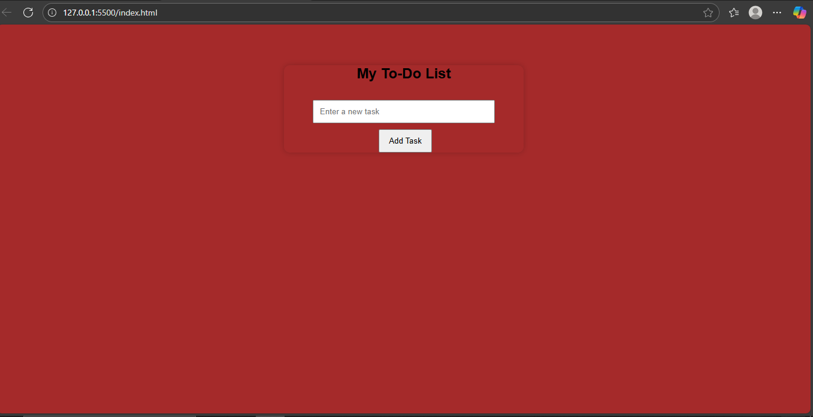

# Age Calculator 🧮

This is a simple web app made using HTML, CSS, and JavaScript.  
It takes your birth year and calculates your current age.

## Screenshot

## How to Use
- Enter your birth year
- Click "Calculate Age"
- Your age will be displayed

---

### 💡 Features:
- Live age calculation
- Responsive layout
- Beginner friendly

---

### 🔗 Live Preview (if deployed)
[Click Here](https://yourusername.github.io/AgeCalculator)
